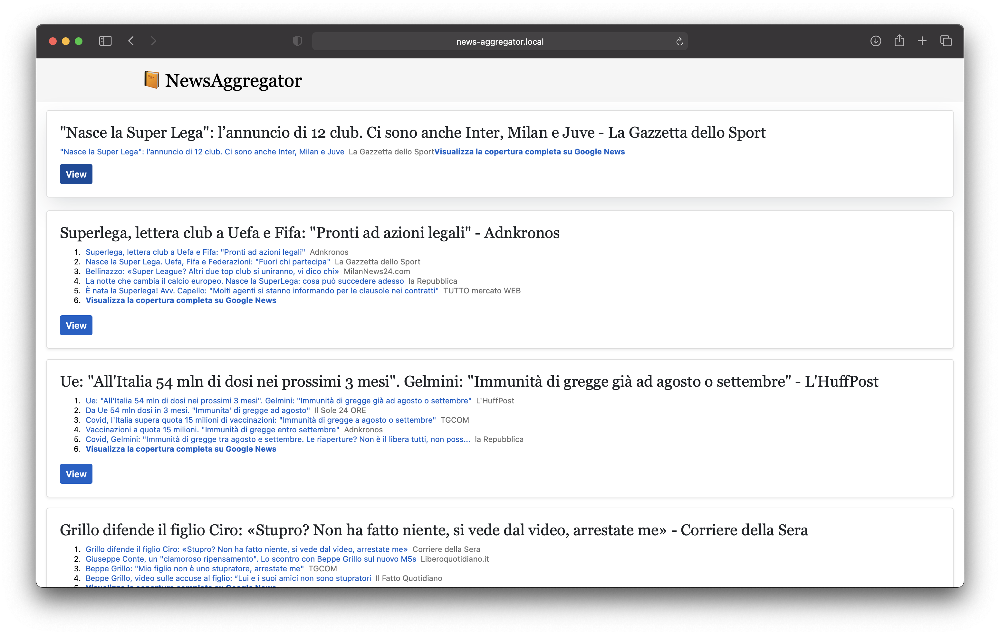

<h1 align="center">Benvenuto su News Aggregator 👋</h1>
<p>
  
  <a href="https://twitter.com/dr_thief">
    
  </a>
</p>

> News aggregator è una web application creata con Symfony 5.2 e permette di raccogliere un'insieme di articoli, 
> scriverne a tua volta altri e commentare.

> Il progetto contiene un'insieme di componenti che andrò ad elencare in dettaglio

# Docker

> Per rendere il progetto facilmente fruibile a terzi è stato predisposto un container docker con al suo interno:
> 
> * Nginx (web server)
> * MariaDB (database relazionale)
> * PHP 8.0.3 
> * MailHog (testing email)
> 
> Tale docker espone i servizi di default sulle porte indicate su `docker-compose.override.yml.dist` ma possono essere 
> sovrascritte su `docker-compose.override.yml`.

> Gli endpoint esposti sono:
> 
> * http://api.news-aggregator.local/ (API)
> * http://news-aggregator.local/ (SPA)

## Comandi utili

```sh
docker-composer up -d
```

# Entity

> La struttura relazionale del progetto prevede l'uso di tre entity:
> 
> * User (contenente gli utenti registrati in piattaforma con ruoli diversi: `ROLE_ADMIN` o `ROLE_USER`)
> * Article (contenente tutti gli articoli scritti da utenti registrati in piattaforma)
> * Comment (contenente tutti i commenti associati agli articoli che possono essere aggiunti anche da utenti non loggati in piattaforma)

# Migration

> I cambiamenti alla struttura del db sono stati gestiti attraverso le migration in modo da avere lo schema sempre consistente
> ad ogni release del codice

## Comandi utili

### Create DB
```sh
symfony console doctrine:database:create
```

### Update DB Schema
```sh
symfony console doctrine:migrations:migrate --no-interaction
```

# Fixtures

> Per avere una base di dati di partenza sulla quale fare i test sono state caricate delle fixtures:
> 
> * 10 users (alcuni in soft-delete)
> * 1 admin
> * 10 articles
> * 50 comments

## Comandi utili

### Reset DB: (drop db, create db, update schema and load fixtures)
```sh
symfony console doctrine:database:drop --force
symfony console doctrine:database:create
symfony console doctrine:migrations:migrate --no-interaction
symfony console doctrine:fixtures:load --no-interaction
```

# Autenticazione

> L'autenticazione è stata gestita attraverso JWT. Interrogando l'endpoint `POST /v1/auth/login` passando:
> ```json
> {
>     "username": "admin@newsaggregator.local",
>     "password": "admin"
> }
>```
> 
> ottengo un token JWT fruibile attraverso `Authorization: Bearer` nelle chiamate che richiedono l'autenticazione.

# API

> Le API sono state costruite attraverso [FOSRestBundle](https://github.com/FriendsOfSymfony/FOSRestBundle) e la loro
> documentazione attraverso [NelmioApiDocBundle](https://github.com/nelmio/NelmioApiDocBundle). Quest'ultima libreria 
> esporrà sia la documentazione in OpenApi (/doc.json) sia un tool visuale (raggiungibile sotto /doc) dove provare 
> ciascun endpoint.


## Formato

> Le risposte alle interrogazioni delle API sono compliant al formato [HATEOAS REST](https://github.com/willdurand/Hateoas).
> Nel caso di una collezione di elementi HATEOAS gestirà anche la parte di paginazione degli elementi.

## DTO

> Per interagire con le API di creazione/modifica di ciascuna entità ci si è avvalsi dei *Data Transfer Object*.
> In questo modo i dati passati dall'utente sono prima validati

# Best-practice

* [UUID](https://symfony.com/doc/current/components/uid.html) 
* [Hexagonal architecture](https://en.wikipedia.org/wiki/Hexagonal_architecture_(software))
* [PHP Coding Standards Fixer](https://github.com/FriendsOfPHP/PHP-CS-Fixer)
* [Conventional Commits](https://www.conventionalcommits.org/en/v1.0.0/)

#SPA

> Per la parte Frontend di visualizzazione dei contenuti si è scelto di costruire una *Single Page Application*.
> Tale SPA è stata costruita basandosi su [Preact](https://preactjs.com/) e 
> [Symfony Encore](https://symfony.com/doc/current/frontend.html) esponendo due pagine pubbliche:
> 
> * **Home** con la lista di tutti gli articoli presenti in piattaforma (basata sull'api `GET /v1/public/articles`)
> * **Article** con il dettaglio di un singolo articolo e tutti i commenti su di esso applicati (basata sull'api `GET /v1/public/articles/{parentId}/comments`)




## CORS

> Per permettere che la SPA possa accedere alle API è stato necessario configurare CORS e mettere tra i domini "allowed"
> `news-aggregator.local`. La gestione è demandata a [NelmioCorsBundle](https://github.com/nelmio/NelmioCorsBundle)

## Comandi utili

### Build Frontend

```sh
cd spa && API_ENDPOINT=http://api.news-aggregator.local:8082/ yarn encore dev
```

## Requirements

* PHP 8.0.0 or higher;
* and the [usual Symfony application requirements][1].

#Altri comandi utili

## Create JWT private and public keys

```sh
mkdir -p config/jwt
openssl genpkey -out config/jwt/private.pem -aes256 -algorithm rsa -pkeyopt rsa_keygen_bits:4096 -pass pass:${JWT_PASSPHRASE}
openssl pkey -in config/jwt/private.pem -out config/jwt/public.pem -pubout -passin pass:${JWT_PASSPHRASE}
```

## Dump ENV
```sh
symfony composer dump-env ${APP_ENV}
```

## Refresh cache
```sh
symfony console cache:clear
```

## Author

👤 **Fabiano Roberto**

* Twitter: [@dr_thief](https://twitter.com/dr_thief)
* Github: [@fabianoroberto](https://github.com/fabianoroberto)

***
_This README was generated with ❤️ by [readme-md-generator](https://github.com/kefranabg/readme-md-generator)_

[1]: https://symfony.com/doc/current/reference/requirements.html
